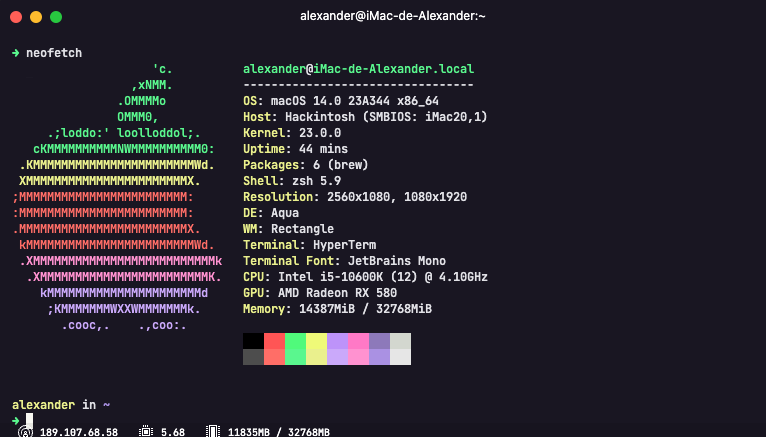
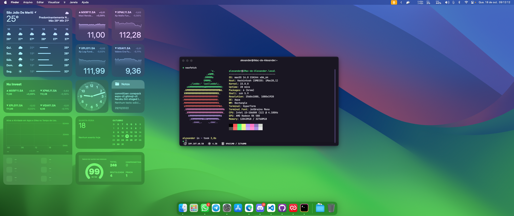
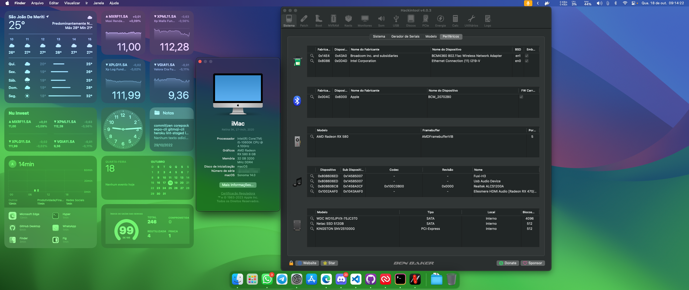

# Hackintosh OpenCore macOS Ventura

Pasta EFI para executar a versão mais recente do macOS Sonoma no Desktop usando o OpenCore como carregador de inicialização.

## [Dortania's Guia de Instalação OpenCore](https://dortania.github.io/OpenCore-Install-Guide)

## Inicialização | [BsxM1](https://github.com/blackosx/BsxM1)

## Sobre o PC

### Hardware Original

| Tipo      | Especificação                             | Status |
|:---------:|:-----------------------------------------:|:------:|
| Placa Mãe | Gigabyte Z490M Gaming X                   | ✅      |
| CPU       | Intel(R) Core(TM) i5-10600K CPU @ 4.10GHz | ✅      |
| Ethernet  | Ethernet Intel(R) I219-V                  | ✅      |
| Wi-Fi     | Fenvi FV - T919                           | ✅      |
| Bluetooth | Fenvi FV - T919                           | ✅      |
| GPU       | AMD Radeon RX 580 8GB OC                  | ✅      |
| Audio     | Realtek ALCS1200A                         | ✅      |
| RAM       | 32GB Kllisre DDR4 3200MHZ                 | ✅      |
| SSD       | Netac 512GB                               | ✅      |

### Used Kexts

[AirportBrcmFixup.kext](https://github.com/acidanthera/AirportBrcmFixup)

[AppleALC.kext](https://github.com/acidanthera/AppleALC)

[CpuTscSync.kext](https://github.com/acidanthera/CpuTscSync)

[IntelMausi.kext](https://github.com/acidanthera/IntelMausi)

[Lilu.kext](https://github.com/acidanthera/Lilu)

[NVMeFix.kext](https://github.com/acidanthera/NVMeFix)

[RealtekRTL8111.kext](https://github.com/acidanthera/RestrictEvents)

[VirtualSMC.kext](https://github.com/acidanthera/VirtualSMC/releases)

[OS-X-USB-Inject-All.kext](https://github.com/Sniki/OS-X-USB-Inject-All)

[VirtualSMC.kext](https://github.com/acidanthera/VirtualSMC)

[WhateverGreen.kext](https://github.com/acidanthera/WhateverGreen)

## Screenshot

